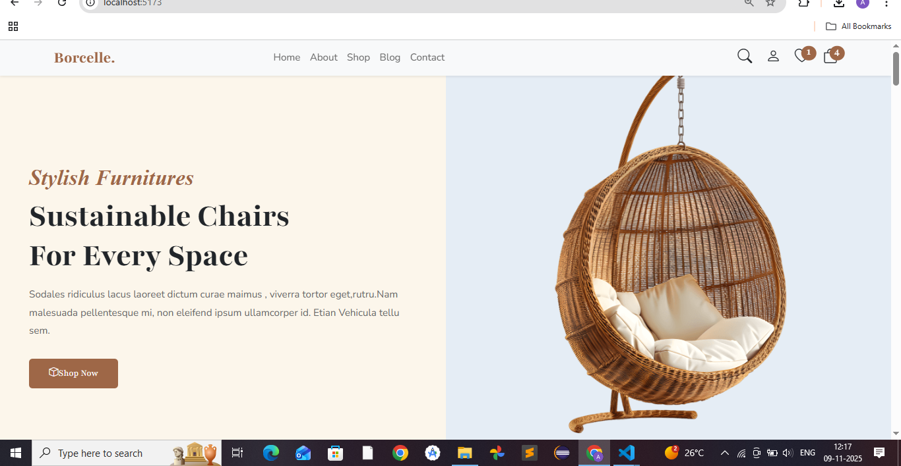
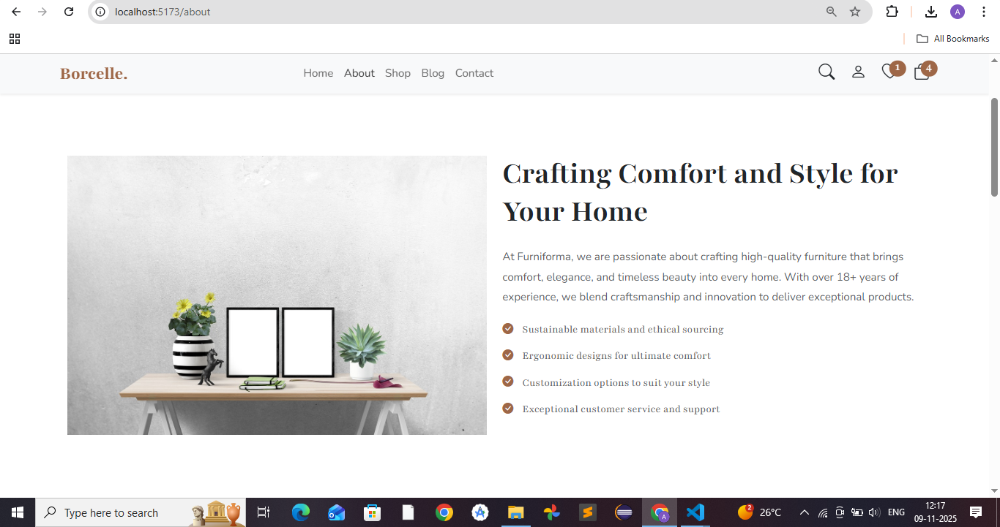
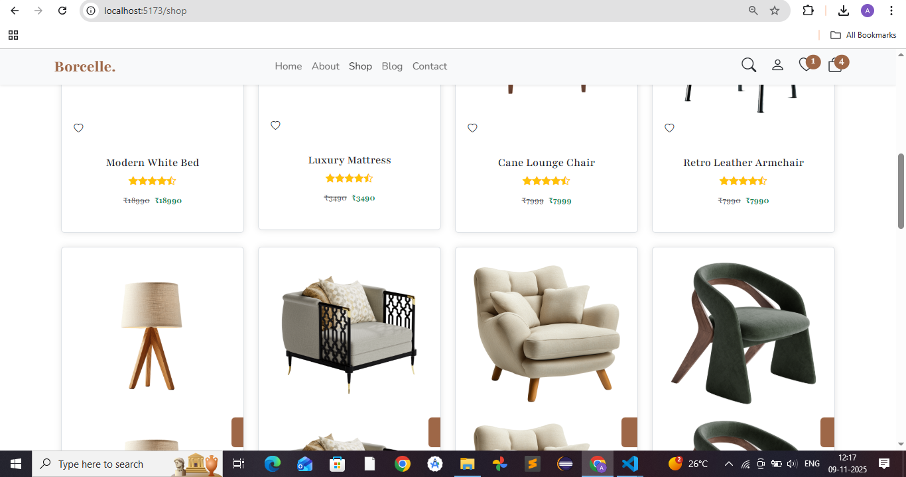
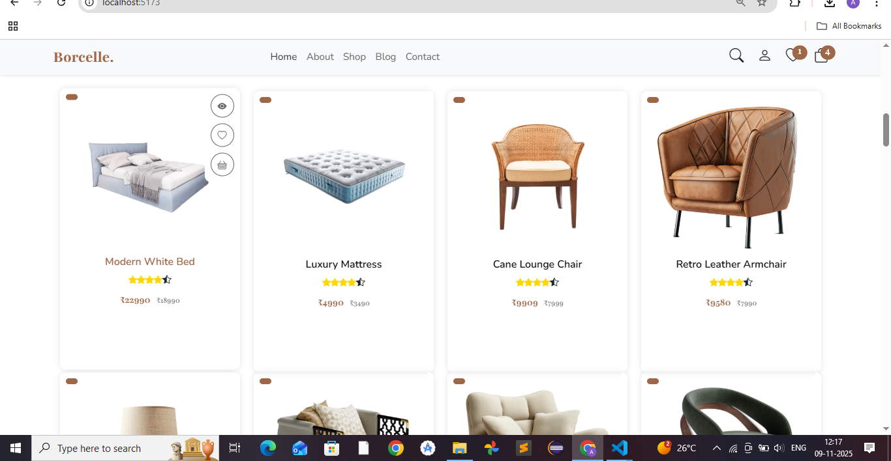
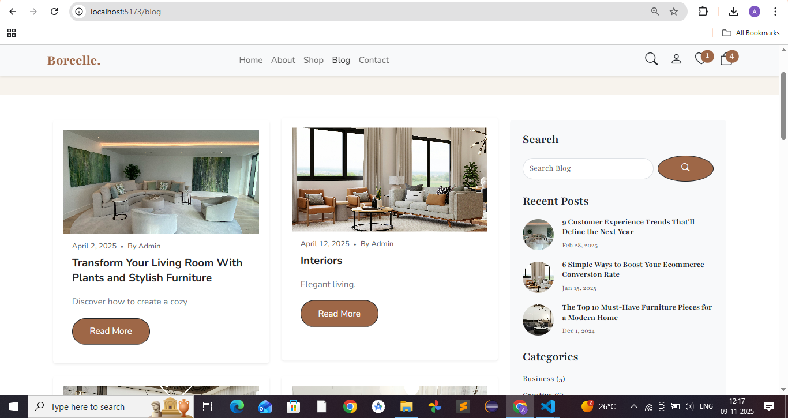
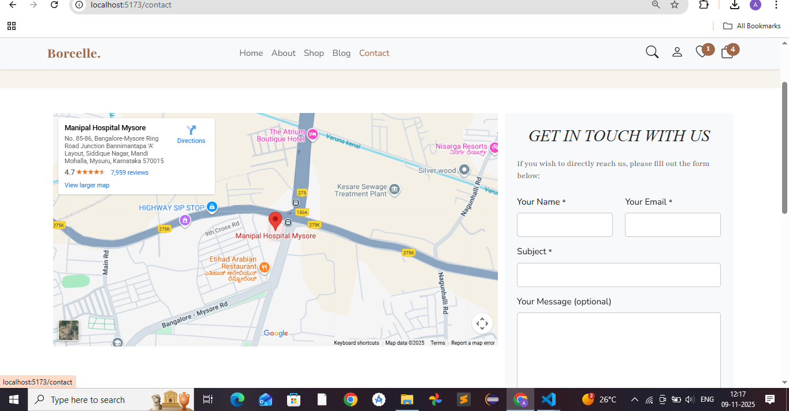
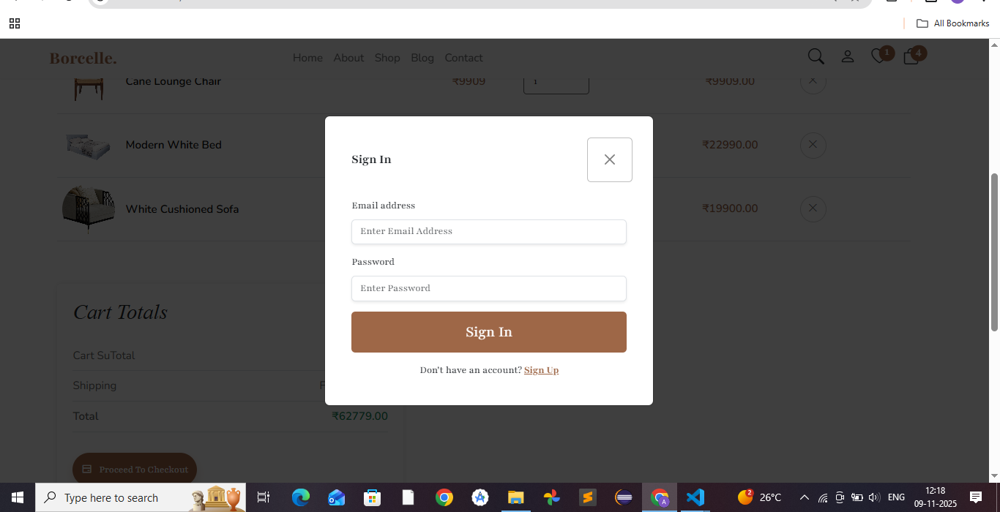
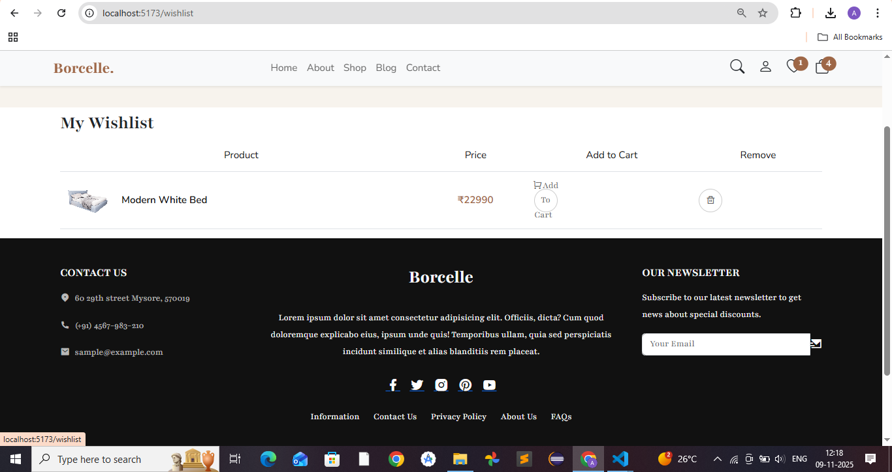
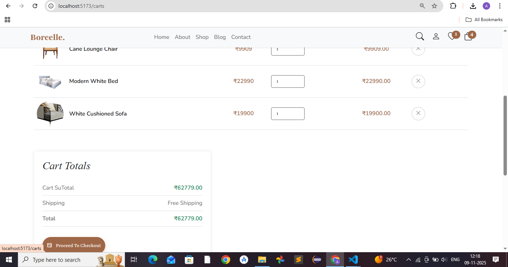

# 🛋️ Borcelle Furniture – Modern E-Commerce Experience


  

Welcome to **Borcelle Furniture**, a sleek and responsive e-commerce website designed for a premium furniture brand.  
Built with **React**, **Vite**, and **Tailwind CSS**, it delivers a smooth and elegant shopping experience with lightning-fast performance ⚡  

---

## 🌐 Live Demo

🪑 **Explore it live:**     [Borcelle Furniture Website](http://localhost:5173/)  


---

## ✨ Features

- 🏠 **Modern Landing Page** – Hero banner with smooth scroll and animations  
- 🪑 **Product Showcase** – Furniture listings with prices, discounts, and hover effects  
- 💬 **Animated Contact Form** – Built with **Framer Motion** for fluid interactions  
- 📱 **Fully Responsive** – Works beautifully on mobile, tablet, and desktop  
- ⚡ **Fast & Lightweight** – Powered by **Vite** for instant builds and performance  
- 🎨 **Clean UI Design** – Elegant, minimal, and user-focused interface  

---

## 🧰 Tech Stack

| Category | Technologies |
|-----------|--------------|
| Framework | React + Vite |
| Styling | Tailwind CSS |
| Animation | Framer Motion |
| Icons | Lucide React Icons |
| Tools | Node.js, npm |

---

## 🖼️ Screenshots

Here’s a quick look at the Borcelle Furniture website 👇 
<p align="center">
  
  
  
</p>

<p align="center">
  
  
  
</p>
<p align="center">
  
  
 
</p>
---

## ⚙️ Getting Started

Follow these steps to run the project locally 👇  

### 1️⃣ Clone the Repository
```bash
git clone https://github.com/afia0872/furniture.git
cd furniture-website
